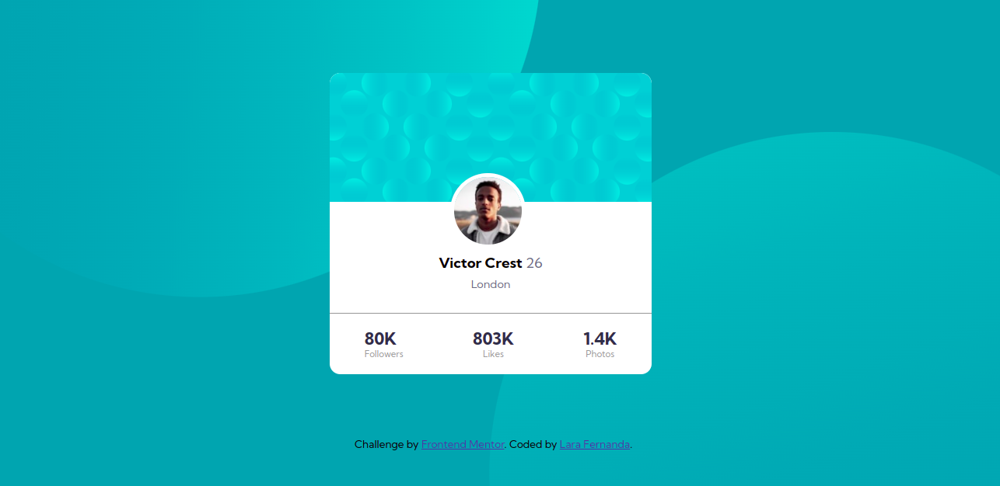

# Profile card component



# Tecnologias

<ul>
    <li>HTML</li>
    <li>Pré-processador Sass</li>
</ul>

# Como executar

Clone o projeto em seu dispositivo e acesse a pasta do mesmo.

```
$ git clone https://github.com/Lara123-pg/ProfileCardComponent-FrontendMentor.git
$ cd ProfileCardComponent-FrontendMentor
$ code .  (Abrir o Visual Studio Code)
```
Logo em seguida, o projeto estará em seu editor para ser executado.

# Projeto

Profile card component é um desafio da plataforma FrontendMentor, que tem o objetivo de treinar os conceitos de HTML, CSS e o pré processador Sass.

# Autor

Lara Fernanda

# Licença

Este projeto está sob a licença MIT -
